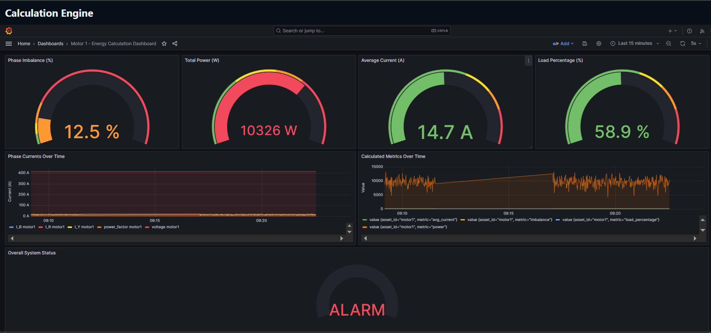

# calculation_engine
## Project Structure

```text
Project Root
│
├── engine/
│   └── calculator.py          # Formula evaluator and calculation pipeline
├── spark/
│   ├── spark_job.py           # Spark Structured Streaming processing
│   └── influx_writer.py       # Writes processed data to InfluxDB
├── frontend/
│   ├── package.json           # Frontend dependencies
│   ├── next.config.js         # Next.js configuration
│   └── pages/
│       └── index.js           # Frontend dashboard page
├── .env                       # Environment variables configuration
├── config.yaml                # Metrics, formulas, alerts, Kafka, InfluxDB config
├── docker-compose.yml         # Runs all project services/containers
├── Dockerfile.frontend        # Frontend container setup
├── Dockerfile.producer        # Producer container setup
├── Dockerfile.spark           # Spark container setup
├── producer.py                # Simulates energy meter readings
├── QUICK_REFERENCE.md         # Setup and execution guide
├── README.md                  # Project documentation
└── requirements.txt           # Python dependencies
```
---

## Setup Guides

Detailed setup and configuration instructions are available in:

- `QUICK_REFERENCE.md`

---

## Frontend Preview



